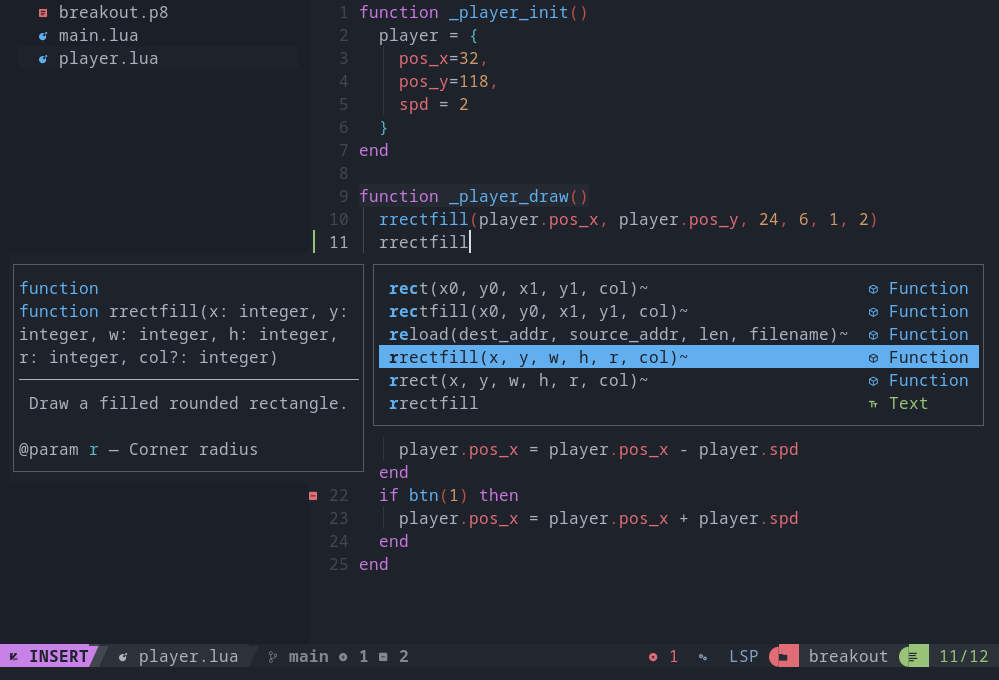

# pico8.nvim

Write [PICO-8](https://www.lexaloffle.com/pico-8.php) carts in Neovim, with completion, hover docs and diagnostics for the full PICO-8 API.

Works with any Neovim setup — no plugin-manager or distribution assumptions. Every feature is individually disableable, and the pieces are usable standalone if you would rather not install a plugin at all.



## Why

`.p8` carts are plain-text containers with the Lua code in the middle and sprite/map/sound data as hex at the bottom. Point `lua_ls` at one and you get a wall of warnings: every API call is an "undefined global", every assignment is a "lowercase global", and `x += 1` is a syntax error. This fixes that, and adds the workflow bits around it.

## Features

- **Completion, signature help and hover docs** for all 99 PICO-8 API functions, with parameter types and per-argument documentation.
- **Correct diagnostics** — PICO-8's `+=`, `!=`, `\=` and friends are accepted; `lowercase-global` is off because PICO-8 code is global by design. Genuine mistakes (typos, wrong argument types) are still reported.
- **Filetype support** — `.p8` gets its own filetype, borrows Lua's treesitter grammar for highlighting, and uses PICO-8's indentation conventions.
- **Folding** for the `__gfx__` / `__map__` / `__sfx__` data sections, so a cart reads as code.
- **Run the cart** from the editor with one keypress, from either the cart or the Lua file it includes.
- **Scaffolding** — `:Pico8New pong` creates a project laid out for editing outside PICO-8.

## Requirements

- Neovim 0.10+ (0.11+ recommended; see [Older Neovim](#older-neovim))
- [PICO-8](https://www.lexaloffle.com/pico-8.php)
- `lua-language-server` — required for completion and hover
- `pico8-ls` — optional, adds diagnostics inside `.p8` files ([see below](#pico8-ls))

## Install

With [lazy.nvim](https://github.com/folke/lazy.nvim):

```lua
{
  "your-name/pico8.nvim",
  ft = { "p8", "lua" },
  opts = {
    carts_dir = "~/pico8",
  },
}
```

With [packer.nvim](https://github.com/wbthomason/packer.nvim):

```lua
use {
  "your-name/pico8.nvim",
  config = function()
    require("pico8").setup()
  end,
}
```

With `vim.pack` (Neovim 0.12+):

```lua
vim.pack.add { "https://github.com/your-name/pico8.nvim" }
require("pico8").setup()
```

You must call `setup()` — with lazy.nvim, `opts` does it for you.

### lua_ls must be enabled separately

This plugin contributes settings to `lua_ls`; it does not install or start it. If you use `nvim-lspconfig`, that means the usual:

```lua
vim.lsp.enable "lua_ls"
```

If your distribution already sets up `lua_ls` (LazyVim, NvChad, kickstart, …), nothing more is needed — the settings are merged additively into whatever is already registered.

## Usage

| Command | Default key | Action |
|---|---|---|
| `:Pico8Run [cart]` | `<leader>pr` | Save, then run the cart in PICO-8 |
| `:Pico8Stop` | `<leader>ps` | Terminate the PICO-8 process nvim started |
| `:Pico8New [name]` | — | Scaffold a new cart project and open its Lua file |
| `:Pico8Info` | — | Print resolved paths and detected tools |
| — | `<leader>pf` | Toggle folding of the cart data sections |

`:Pico8Run` works from the `.p8` **or** from the Lua file it includes — it walks up from the current file to find a sibling cart. If a directory holds several carts you are asked which one.

Once PICO-8 is running, <kbd>Ctrl</kbd>+<kbd>R</kbd> **inside the PICO-8 window** reloads from disk. That is a faster loop than relaunching, and it keeps the console history.

## Configuration

Defaults shown:

```lua
require("pico8").setup {
  pico8_cmd = "pico8",          -- binary, or an absolute path
  run_args = { "-run" },        -- args before the cart path
  carts_dir = "~/pico8",        -- where :Pico8New scaffolds
  include_file = "main.lua",    -- the file new carts #include
  cart_version = 42,            -- `version` header for new carts

  lsp = {
    enable = true,              -- contribute settings to lua_ls
    pico8_ls = true,            -- attach pico8-ls to .p8 if installed
    tune_diagnostics = true,    -- disable lint rules that fight PICO-8
  },

  folding = {
    enable = true,
    start_closed = true,        -- data sections folded on open
  },

  keymaps = {
    run = "<leader>pr",
    stop = "<leader>ps",
    new = false,                -- false disables a mapping
    toggle_folds = "<leader>pf",
  },
}
```

To set your own keys, pass `keymaps = { run = false }` and map `:Pico8Run` yourself.

## The `#include` workflow

`:Pico8New pong` produces:

```
~/pico8/pong/
├── pong.p8      # six-line shell: header, #include, one blank sprite row
└── main.lua     # your code, as plain Lua
```

The cart is a thin wrapper; `main.lua` is where you work — no header, no hex, and `lua_ls` sees a normal Lua file. PICO-8 resolves `#include` at load time, so <kbd>Ctrl</kbd>+<kbd>R</kbd> picks up your edits.

Three things to know:

- **Include paths are relative to the cart.** Keep `main.lua` beside the `.p8`.
- **Multiple includes are concatenated into one scope.** No modules, no `require`; a function in `player.lua` is globally visible. Order matters only for top-level code.
- **Never edit code in PICO-8's built-in editor.** Its code tab shows the literal `#include main.lua` line; type over it and save, and the include is replaced by expanded code — the link breaks silently. Sprites, map and sound are always safe to edit there.

Splitting files does not buy you tokens: the 8192-token limit counts every include.

## Using the pieces without the plugin

The API definitions are just an annotated Lua file, so any `lua_ls` client can use them — Neovim without this plugin, VS Code, Zed, Helix.

Copy `extras/luarc.json` to the root of your carts directory, rename it `.luarc.json`, and set `workspace.library` to this repo's `types/` directory:

```json
{
  "workspace": { "library": ["/path/to/pico8.nvim/types"] },
  "runtime": { "nonstandardSymbol": ["+=", "-=", "!=", "//"] },
  "diagnostics": { "disable": ["lowercase-global"] }
}
```

One `.luarc.json` at the root of your projects folder covers every cart underneath it, since `lua_ls` walks up from the file to find it. If you `git init` an individual game, put a copy inside it too — `.git` is also a root marker and would otherwise win by being closer.

## pico8-ls

[`pico8-ls`](https://github.com/japhib/pico8-ls) is a language server that understands the `.p8` container itself, giving diagnostics inside carts rather than only in included Lua files. It is optional.

It ships **only as a VS Code extension** — there is no `pico8-ls` package on npm, so `npm i -g pico8-ls` returns 404. Build it from source:

```sh
./scripts/install-pico8-ls.sh
```

That clones the repo, builds `server/`, and installs a wrapper to `~/.local/bin/pico8-ls`. Set `PREFIX` to install elsewhere. The build prints errors from the upstream test files (missing mocha types) — harmless, as long as `out/server.js` is produced.

Once it is on your `PATH`, this plugin attaches it to `.p8` files automatically.

## Older Neovim

On 0.11+ the settings are registered through `vim.lsp.config`. On 0.10 there is no such API, so they are patched onto `lua_ls` from an `LspAttach` autocommand instead — same result, slightly less direct. `pico8_ls` auto-attach requires 0.11+.

## Troubleshooting

Run `:checkhealth pico8` first — it reports missing binaries, the resolved definitions path, and whether `pico8-ls` was found.

**Still seeing `Undefined global 'cls'`.** `lua_ls` reads its configuration at startup, so restart Neovim. If it persists, check `:Pico8Info` shows a `types dir` that exists, and confirm `lua_ls` is attached with `:LspInfo`.

**A project-local `.luarc.json` wins over this plugin.** If one exists at your project root, `lua_ls` uses it *instead of* the settings sent by the client. Either delete it or add the `types/` path to its `workspace.library`.

**`:Pico8Run` says no cart found.** It looks for a `*.p8` beside the current file and upward. An unsaved, unnamed buffer has no path to search from.

**Highlighting looks wrong at the bottom of a cart.** Expected. There is no treesitter grammar for the `.p8` container, so Lua's is reused and the hex data sections confuse it. They are data, not code — fold them with `<leader>pf`.

## Verifying the API definitions

`types/pico8.lua` is transcribed by hand, so there is a script to check it against the manual PICO-8 ships:

```sh
lua scripts/check-api.lua                      # finds the manual automatically
lua scripts/check-api.lua /path/to/manual.txt   # or point at it
lua scripts/check-api.lua --list                # print the parsed API
```

It parses the signature lines out of `pico-8_manual.txt` and reports three kinds of drift:

- **MISSING** — documented in the manual, no stub here
- **UNKNOWN** — a stub with no manual entry (a typo, or an invention)
- **MISMATCHED** — arity or optionality differs from the documented signature

Exit status is 0 when everything matches, so it works as a pre-commit hook.

A handful of signatures are exempt, listed in `KNOWN_DIFFS` at the top of the script with a reason each — the manual documents `pal` and `print` in two forms, has a couple of typos of its own (`SSPR` has an unbalanced bracket, `RELOAD` a missing comma), and marks several parameters required that PICO-8 actually accepts as absent. Those last were confirmed by running `pico8 -x` rather than taken on trust.

CI runs the same check against `test/fixtures/manual-signatures.txt`, since the manual ships only with PICO-8 and cannot be installed on a runner. Refresh the fixture after a PICO-8 upgrade:

```sh
scripts/make-fixture.sh
```

## Credits

- PICO-8 by [Lexaloffle](https://www.lexaloffle.com/) — the API definitions were transcribed from the manual shipped with v0.2.7.
- [`pico8-ls`](https://github.com/japhib/pico8-ls) by JanPaul Bergeson.

## License

MIT
